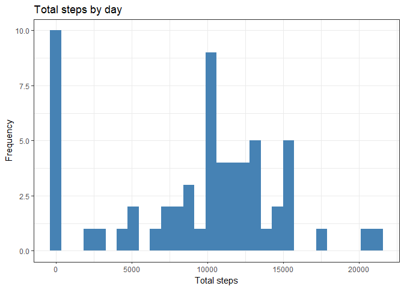
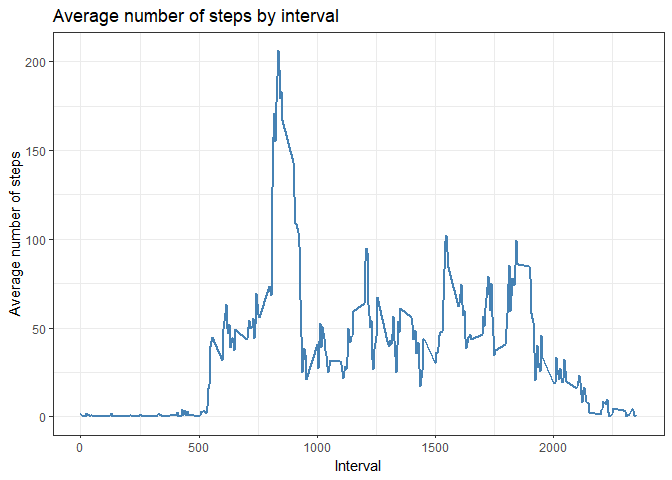
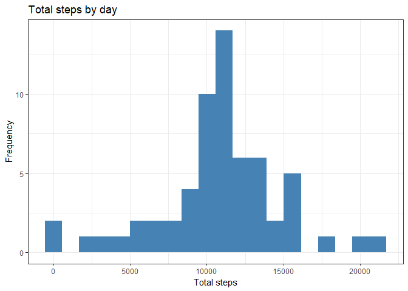
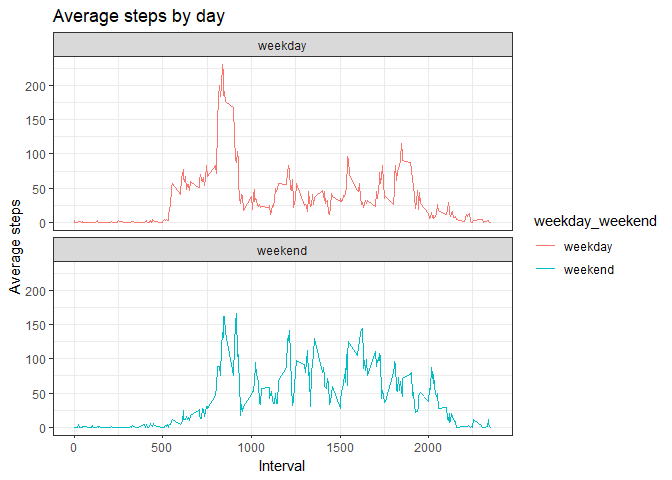

## Introduction

This is first course project of Reproducible research course by JHU on Coursera. This project provides basic analysis of moving activities based on the dataset available from personal activity monitoring devices. There are five questions to be answered in this research:

- loading and preprocessing the data;  
- what is mean total number of steps taken per day?  
- what is the average daily activity pattern?  
- imputing missing values  
- are there differences in activity patterns between weekdays and weekends?

## Loading and preprocessing the data

To complete this task, you need to unzip the archive with the file and read the file. One way to approach this task is using *dplyr* and *lubridate* libraries.


```r
setwd("C:/Users/Георгий/Documents/GitHub/RepData_PeerAssessment1")
exit_data_filename <- "activity.csv"
if (!file.exists(exit_data_filename)) {
    unzip(zipfile = "activity.zip")}
activity <- read.csv("activity.csv")

library(dplyr)
library(lubridate)
activity <- activity %>% 
    mutate(date = ymd(activity$date))
summary(activity)
```

```
##      steps             date               interval     
##  Min.   :  0.00   Min.   :2012-10-01   Min.   :   0.0  
##  1st Qu.:  0.00   1st Qu.:2012-10-16   1st Qu.: 588.8  
##  Median :  0.00   Median :2012-10-31   Median :1177.5  
##  Mean   : 37.38   Mean   :2012-10-31   Mean   :1177.5  
##  3rd Qu.: 12.00   3rd Qu.:2012-11-15   3rd Qu.:1766.2  
##  Max.   :806.00   Max.   :2012-11-30   Max.   :2355.0  
##  NA's   :2304
```

## What is mean total number of steps taken per day?

In this task you have to: 

- calculate total number of steps taken per day;  
- make a histogram of the total number of steps taken each day;  
- calculate and report the mean and the median of the total number of steps taken per day.

This task requires grouping values by date and making group summaries of steps. I made the histogram using *ggplot* library. The histogram had been saved in *hist1.png* file.

Fisrt, the grouped summary of total steps per day. I had omitted the *NA* values for the summary.


```r
steps_by_day <- activity %>% 
    group_by(date) %>% summarise(total_steps = sum(steps, na.rm = TRUE))
head(steps_by_day)
```

```
## # A tibble: 6 x 2
##   date       total_steps
##   <date>           <int>
## 1 2012-10-01           0
## 2 2012-10-02         126
## 3 2012-10-03       11352
## 4 2012-10-04       12116
## 5 2012-10-05       13294
## 6 2012-10-06       15420
```

Then comes the histogram of total steps per day.


```r
library(ggplot2)

file1 <- "./figure/hist1.png"
png(file1, height = 480, width = 480)
ggplot(steps_by_day) +
    theme_bw() +
    geom_histogram(aes(total_steps), fill = "steelblue") +
    xlab("Total steps") + ylab("Frequency") +
    ggtitle("Total steps by day")
dev.off()
```

```
## png 
##   2
```

```r
ggplot(steps_by_day) +
    theme_bw() +
    geom_histogram(aes(total_steps), fill = "steelblue") +
    xlab("Total steps") + ylab("Frequency") +
    ggtitle("Total steps by day")
```

<!-- -->

Finally, the mean and the median for the total steps.


```r
mean(steps_by_day$total_steps)
```

```
## [1] 9354.23
```

```r
median(steps_by_day$total_steps)
```

```
## [1] 10395
```

## What is the average daily activity pattern?

To complete this task you need to make a time series plot of the 5-minute interval against average number of steps. When this is ready you have to find the interval with the maximum number of steps.

In order to make a time series plot you have to group the values by time intervals and find mean number of steps per interval. I had approached this with *dplyr* package and the plot itself with *ggplot* library. The plot was saved to *line1.png* file.


```r
steps_by_interval <- activity %>%
    group_by(interval) %>% summarise(steps = mean(steps, na.rm = TRUE))

file2 <- "./figure/line1.png"
png(file2, height = 480, width = 480)
ggplot(steps_by_interval) +
    theme_bw() +
    geom_line(aes(interval, steps), color = "steelblue", lwd = 1.0) +
    xlab("Interval") + ylab("Average number of steps") +
    ggtitle("Average number of steps by interval")
dev.off()
```

```
## png 
##   2
```

```r
ggplot(steps_by_interval) +
    theme_bw() +
    geom_line(aes(interval, steps), color = "steelblue", lwd = 1.0) +
    xlab("Interval") + ylab("Average number of steps") +
    ggtitle("Average number of steps by interval")
```

<!-- -->

Finding the interval with the maximum average number of steps.


```r
steps_by_interval[which.max(steps_by_interval$steps),]$interval
```

```
## [1] 835
```

## Imputing missing values

Solving the problem of missing values requires making 4 steps:

- calculate and report the total number of missing values in the dataset;  
- use mean by interval to subsitute missing values;  
- make new dataset with missing values filled in;  
- make a histogram of the total steps per day and report mean and median.

First, you need to calculate the number of missing values.


```r
sum(is.na(activity$steps))
```

```
## [1] 2304
```

With this you need to find what is the proportion of missing values compared to total number of observations.


```r
sum(is.na(activity$steps))/nrow(activity)
```

```
## [1] 0.1311475
```

With 13.1 percent of missing observations you can expect bias in calculations or summaries of the data. Knowing this you can subsitute missing values with mean value of respective interval.


```r
substitute_steps <- steps_by_interval$steps[match(activity$interval, 
                                              steps_by_interval$interval)]
```

Now you are able to make new dataset.


```r
imputed_data <- activity %>% 
    mutate(imputed_steps = ifelse(is.na(activity$steps),
                                  substitute_steps,
                                  activity$steps)) %>% 
    select(imputed_steps, date, interval)

imp_steps_by_day <- imputed_data %>% 
    group_by(date) %>% summarise(total_steps = sum(imputed_steps, 
                                                   na.rm = TRUE))
head(imp_steps_by_day)
```

```
## # A tibble: 6 x 2
##   date       total_steps
##   <date>           <dbl>
## 1 2012-10-01      10766.
## 2 2012-10-02        126 
## 3 2012-10-03      11352 
## 4 2012-10-04      12116 
## 5 2012-10-05      13294 
## 6 2012-10-06      15420
```

You use this dataset for making a histogram. The histogram is saved in *hist2.png* file.


```r
file3 <- "./figure/hist2.png"
png(file3, height = 480, width = 480)
ggplot(imp_steps_by_day) +
    theme_bw() +
    geom_histogram(aes(total_steps), bins = 20 , fill = "steelblue") +
    xlab("Total steps") + ylab("Frequency") +
    ggtitle("Total steps by day")
dev.off()
```

```
## png 
##   2
```

```r
ggplot(imp_steps_by_day) +
    theme_bw() +
    geom_histogram(aes(total_steps), bins = 20 , fill = "steelblue") +
    xlab("Total steps") + ylab("Frequency") +
    ggtitle("Total steps by day")
```

<!-- -->

Finally, the new mean and the new median for the total steps.


```r
mean(imp_steps_by_day$total_steps)
```

```
## [1] 10766.19
```

```r
median(imp_steps_by_day$total_steps)
```

```
## [1] 10766.19
```

## Are there differences in activity patterns between weekdays and weekends?

In order to complete this task you need to create a new factor variable in the dataset with two levels – “weekday” and “weekend” indicating whether a given date is a weekday or weekend day. The dataset for this task is the dataset with imputed values. When new dataset is ready you need to plot a time series plot of the 5-minute interval and the average number of steps taken.

Start with making days out of dataset and assigning them to weekday or weekend.


```r
day_of_week <- wday(imputed_data$date, week_start = 1)
imputed_data <- cbind(imputed_data, day_of_week)

weekday_weekend <- sapply(imputed_data$date, function(x){
    if (wday(x, week_start = 1) == 6 | 
        wday(x, week_start = 1) == 7) 
        {y <- "weekend"}
    else {y <- "weekday"}
})

day_data <- cbind(imputed_data, weekday_weekend)
```

Now you can recalculate the average steps by interval.


```r
day_data_interval <- day_data %>%
    group_by(interval, weekday_weekend) %>% 
    summarise(steps = mean(imputed_steps, na.rm = TRUE))
head(day_data_interval)
```

```
## # A tibble: 6 x 3
## # Groups:   interval [3]
##   interval weekday_weekend  steps
##      <int> <fct>            <dbl>
## 1        0 weekday         2.25  
## 2        0 weekend         0.215 
## 3        5 weekday         0.445 
## 4        5 weekend         0.0425
## 5       10 weekday         0.173 
## 6       10 weekend         0.0165
```

With this it is time to make a plot. The plot is saved as *line2.png* file.


```r
file4 <- "./figure/line2.png"
png(file4, height = 480, width = 480)
ggplot(day_data_interval) +
    theme_bw() +
    geom_line(aes(interval, steps, color = weekday_weekend)) +
    facet_wrap( ~ weekday_weekend, ncol = 1, nrow = 2) +
    ggtitle("Average steps by day") + xlab("Interval") +
    ylab("Average steps")
dev.off()
```

```
## png 
##   2
```

```r
ggplot(day_data_interval) +
    theme_bw() +
    geom_line(aes(interval, steps, color = weekday_weekend)) +
    facet_wrap( ~ weekday_weekend, ncol = 1, nrow = 2) +
    ggtitle("Average steps by day") + xlab("Interval") +
    ylab("Average steps")
```

<!-- -->


